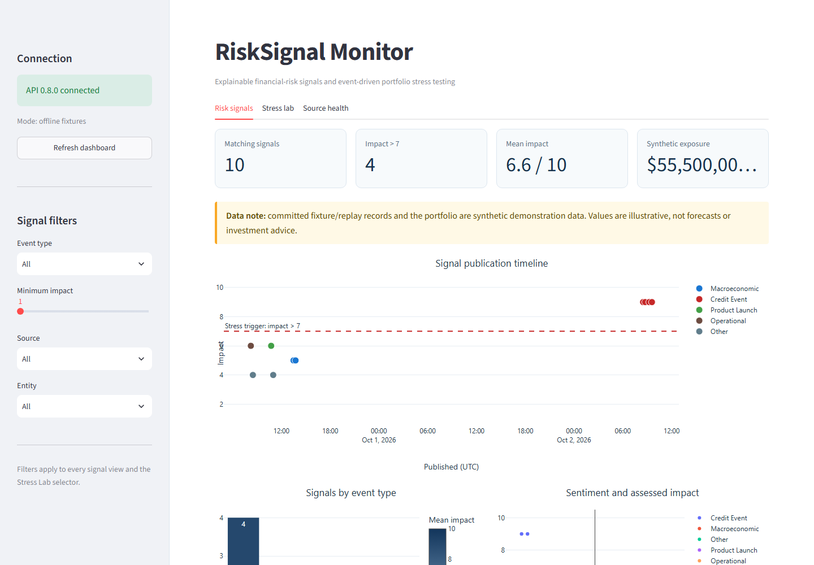
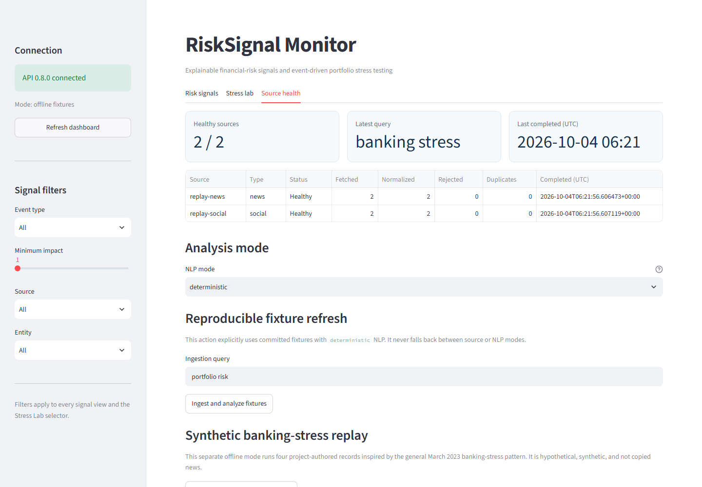
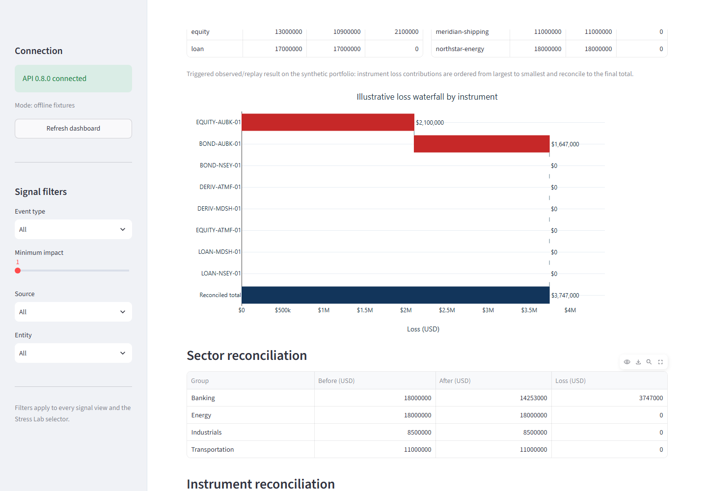
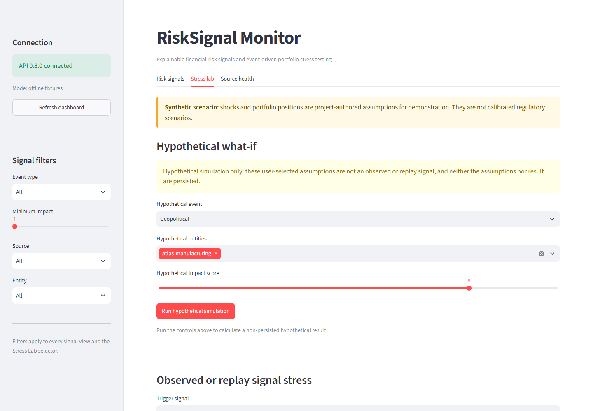

# RiskSignal Engine - S&P Global & Crisil Campus Hackathon

**Candidate Name:** Chennaboyana Jaya Surya
**College Email ID:** 112315046@cse.iiitp.ac.in
**College / Campus:** Indian Institute of Information Technology, Pune
**Implementation Status:** Phase 16 complete - release and demo workflow ready
**Demo Video Link:** To be added after the recorded walkthrough
**Slide Deck:** [Download the six-slide presentation PDF](docs/presentation.pdf)

## 1. Project Overview / Problem Statement & Approach

RiskSignal Engine is a modular financial-risk prototype that converts unstructured
news and social-media text into machine-readable risk signals. Each signal includes
a sentiment score, event classification, impact score, entity references, source
provenance, and an explanation of the factors that produced the score.

The implemented downstream application is strategic portfolio stress testing. Events with
an impact score greater than 7 trigger an appropriate scenario against a fictional
wholesale-banking portfolio containing loans, bonds, equities, and derivatives. The
application shows portfolio value and expected loss before and after the stress,
with breakdowns by issuer, sector, asset class, and instrument.

The impact formula uses absolute sentiment magnitude and is therefore
direction-agnostic: strongly positive and strongly negative language can both raise a
score. An eligible positive-sentiment signal reflects magnitude plus the other stored
factors; it is not a claim that positive sentiment is harmful.

Derivative stress uses signed USD `delta_exposure`, a decimal `underlying_shock`, and
positive DV01 as USD loss per +1 bp move; positive `rate_shock_bps` means rates rise.
The linear approximation is documented alongside its limitations in the architecture.

The implementation prioritizes a reproducible offline demonstration while retaining
live adapters for GDELT news and Bluesky public posts. The committed presentation and
demo runbook use the same tested synthetic evidence as the application.

## 2. Architecture & Tech Stack


The implemented flow is:

```text
GDELT / Bluesky / fixtures
        -> normalization and deduplication
        -> entity resolution
        -> FinBERT sentiment + event classification
        -> explainable impact scoring
        -> SQLite + FastAPI
        -> portfolio stress engine
        -> Streamlit dashboard
```

Stack: Python 3.11–3.13, FastAPI, Pydantic, SQLite, Hugging Face
Transformers, Sentence Transformers, Pandas, Streamlit, Plotly, Pytest, and Ruff.
The full design and interface decisions are documented in
[docs/architecture.md](docs/architecture.md).

## 3. Dataset Used

- Live news metadata and headlines from the public GDELT DOC API.
- Live public social posts from the Bluesky AppView API.
- Small offline fixtures matching both source schemas for deterministic evaluation.
- A fully synthetic portfolio with fictional counterparties and transactions.
- Financial PhraseBank v1.0 `sentences_allagree` for an optional, non-commercial local
  sentiment benchmark; its raw and derived files are not committed.

Every committed dataset or fixture has a source URL or synthetic declaration,
retrieval details, transformations, redistribution notes, assumptions, and checksum
recorded under `data/`. No proprietary or confidential client data is used.
See [data/README.md](data/README.md) and the machine-readable
[source manifest](data/sources.yaml) for the provenance record. The consolidated
[dataset and assumption guide](docs/dataset-guide.md) distinguishes public interfaces,
committed synthetic artifacts, optional models, and the claims each source can support.
The external benchmark's immutable source, CC BY-NC-SA 3.0 terms, local checksum,
selection rules, metrics, and limitations are recorded in
[docs/benchmark.md](docs/benchmark.md).

## 4. Quickstart & Installation

Runtime: Python 3.11 through 3.13. CI verifies Python 3.11 on Ubuntu; local development
has been verified on Python 3.13 on Windows.

```bash
git clone https://github.com/Jaysurya046/IIIT_Pune-Chennaboyana_Jaya_Surya-hackathon.git
cd IIIT_Pune-Chennaboyana_Jaya_Surya-hackathon
python -m venv .venv
```

Activate the environment with `.venv\Scripts\Activate.ps1` on Windows PowerShell or
`source .venv/bin/activate` on macOS/Linux, then run:

```bash
python -m pip install -r requirements-dev.txt
python -m risk_engine check
python -m risk_engine ingest-fixtures --query "portfolio risk"
python -m risk_engine analyze-fixtures --query "portfolio risk"
python -m risk_engine stress-fixtures --query "portfolio risk"
python -m risk_engine replay
python -m risk_engine validate --output data/runtime/validation-report.json
python -m ruff check .
python -m pytest
```

Copy `.env.example` to `.env` only when local overrides are required. Do not commit
the resulting `.env` file. The fixture commands exercise both source types through
validation, normalization, provenance capture, and deduplication without requiring
network access. The separate `replay` command runs four checksummed synthetic records
through the unchanged deterministic engine and produces an organic triggered stress
result without editing a signal score.

The analysis command defaults to a transparent deterministic NLP implementation. To
run the pinned FinBERT sentiment and MiniLM semantic event models, install the optional
dependencies and explicitly select model mode:

```bash
python -m pip install -r requirements-nlp.txt
python -m risk_engine analyze-fixtures --query "portfolio risk" --nlp-mode model
python -m risk_engine benchmark --dataset <csv> --text-col <name> --label-col <name>
```

The first model-mode run downloads weights into the ignored cache directory. Exact
model revisions, license metadata, and limitations are recorded in
[data/models.yaml](data/models.yaml); downloaded weights are not committed.

For the reviewer path, one command seeds the four-record replay, analyzes it with the
deterministic engine, starts the API, waits for health, and launches the dashboard:

```bash
python -m risk_engine demo
```

Use `--source-mode fixtures` for the six-record baseline, `--nlp-mode model` only when
the pinned weights are installed, `--api-port` and `--dashboard-port` for alternate
ports, and `--no-open-browser` for headless use. Invalid or unavailable selections fail
explicitly and never switch modes.

Start the local API with:

```bash
python -m risk_engine serve --host 127.0.0.1 --port 8000
```

The interactive API documentation is then available at `http://127.0.0.1:8000/docs`.
The complete endpoint workflow and error semantics are documented in
[docs/api.md](docs/api.md). The default SQLite database is created under the ignored
`data/runtime/` directory.

With the API running, start the dashboard in a second terminal:

```bash
python -m risk_engine dashboard --host 127.0.0.1 --port 8501 --api-url http://127.0.0.1:8000
```

Open `http://127.0.0.1:8501`. On an empty database, use **Source health** to run the
explicit fixture workflow or separate synthetic banking-stress replay. The dashboard
guide, filter behavior, metric definitions, and source classifications are documented
in [docs/dashboard.md](docs/dashboard.md).

The GDELT adapter is credential-free. Bluesky search availability varies by AppView;
when authentication is required, provide a short-lived bearer token only through the
ignored `RISK_ENGINE_BLUESKY_BEARER_TOKEN` environment setting.

## 5. Key Results & Domain Impact

The table consolidates the evidence that can be reproduced from committed code or the
documented local benchmark. Synthetic results demonstrate implementation correctness;
they are not forecasts, calibrated regulatory results, or investment advice.

| Evidence | Recorded result | Interpretation boundary |
|---|---|---|
| Financial PhraseBank v1.0, deterministic mode | Accuracy 0.6793; macro-F1 0.4305; 0/2,264 signals above 7 | Sentiment comparison on expert-labelled text; Phase 17 bounded matching and negation rules; no trigger-quality labels |
| Financial PhraseBank v1.0, pinned FinBERT | Accuracy 0.9717; macro-F1 0.9625; 0/2,264 signals above 7 | The model's published training data includes this dataset, so this is not an out-of-sample estimate |
| Synthetic NLP regression | 8/8 event, sentiment, and entity exact matches across all eight event categories | Authored regression coverage, not real-world predictive accuracy |
| Synthetic replay | Four checksummed records produce four impact-9 signals and organic persisted triggers | Fictional Aurora Bank; unchanged deterministic engine; no copied article text |
| Synthetic portfolio stress | USD 55.50M across eight positions; Aurora replay loss USD 3.747M; reconciliation USD 0.00 | Project-authored positions and shocks; simplified valuation paths |
| Offline validator | 9/9 manifested artifacts; 6/6 persisted baseline signals; boundary-probe loss USD 2.35M | Reproducibility and contract evidence under the local five-second budget; Phase 17 inflection matching changes the selected event severity |

The benchmark provenance and confusion matrices are in
[docs/benchmark.md](docs/benchmark.md). Calculation details, assumptions, and
limitations are in [docs/results.md](docs/results.md).

These screenshots use the committed synthetic fixtures and replay bundle and retain
their synthetic or hypothetical disclosures.

<p>
  
  
</p>
<p>
  
  
</p>

## Reviewer Guide

- [Reproducible implementation guide](docs/implementation-guide.md) — clean setup,
  complete run path, optional modes, quality gates, and troubleshooting.
- [Architecture decisions](docs/architecture.md) — components, contracts, scoring,
  valuation, persistence, reliability, and scope boundaries.
- [Dataset source and assumption guide](docs/dataset-guide.md) — public interfaces,
  synthetic artifacts, transformations, redistribution, and limitations.
- [Validation evidence](docs/validation.md) — independent checks, recorded baseline,
  failure paths, and caveats.
- [External sentiment benchmark](docs/benchmark.md) — immutable source, licence,
  reproducible command, real-data metrics, confusion matrices, and limitations.
- [Results and domain impact](docs/results.md) — implemented capability, evidence,
  usefulness, limitations, and next steps.
- [Demonstration runbook](docs/demo-script.md) — separate five-minute live and
  up-to-ten-minute recorded walkthroughs.
- [Presentation PDF](docs/presentation.pdf) — six-slide problem, architecture, data,
  evidence, stress result, and limitation summary.
- [Post-implementation improvement plan](docs/improvement-plan.md) — Phases 9–20,
  task dependencies, data gates, tests, commands, and conventional commits.
- [API guide](docs/api.md) and [dashboard guide](docs/dashboard.md) — operational
  contracts, filters, metrics, and error semantics.

The presentation PDF is committed and linked above. The remaining submission handoff
is the unlisted YouTube walkthrough; its link and the public repository should be tested
from an incognito window before submission.

## Development Progress

Implementation status, verification evidence, decisions, and blockers are maintained
in [docs/progress.md](docs/progress.md). Each completed phase is delivered as a focused
commit.
