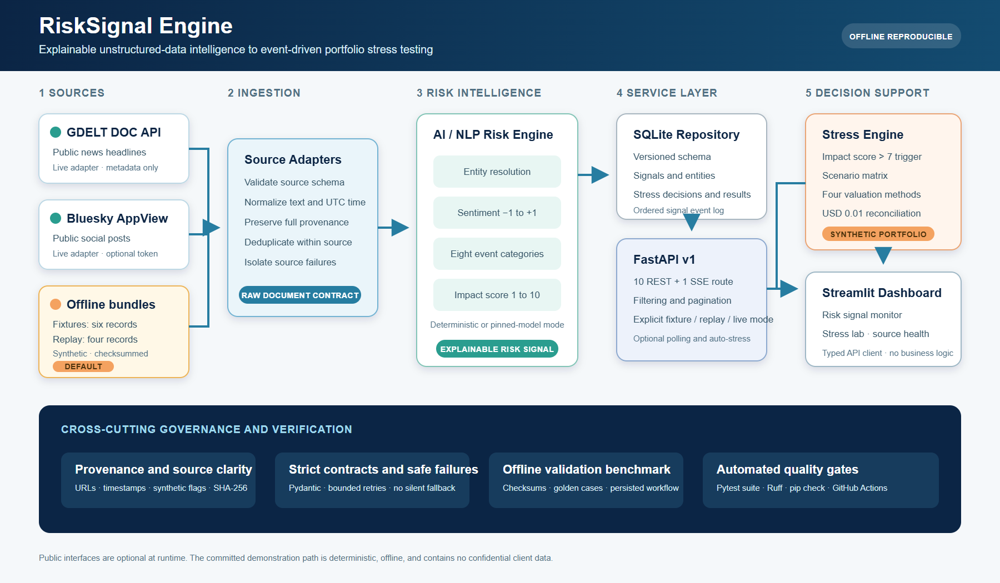
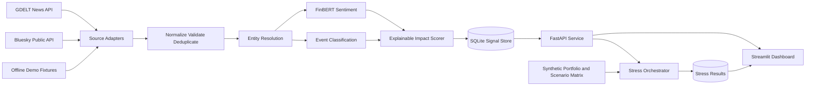
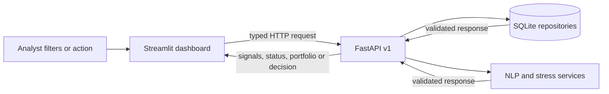

# RiskSignal Engine Architecture and Implementation Decisions

## Purpose

RiskSignal Engine ingests unstructured financial news and social-media text,
produce structured and explainable financial-risk signals, and demonstrate those
signals through an event-driven portfolio stress-testing application.

The implementation must process at least two source types and produce a sentiment
score, event classification, and impact score. The selected downstream application
is strategic portfolio stress testing. Tactical index rebalancing remains a possible
future extension but is not part of the initial implementation.



The editable vector source is stored at `docs/assets/architecture.svg`; the PNG is the
high-resolution reviewer and presentation asset required by the submission structure.

## Success Criteria

- Process news and social text through live adapters and deterministic offline fixtures.
- Produce a signed sentiment score between -1 and 1.
- Classify each accepted record into a documented financial-event taxonomy.
- Produce an explainable integer impact score from 1 through 10.
- Preserve source, query, retrieval, transformation, and model provenance.
- Expose signals and stress results through a versioned HTTP API.
- Trigger a stress test when a relevant signal has an impact score greater than 7.
- Visualize signal history and portfolio value before and after stress.
- Run tests without requiring network access.
- Use only public or clearly identified synthetic data.

## System Context



## Component Responsibilities

### Source adapters

The GDELT adapter retrieves recent news metadata and headlines for configured company
aliases and risk terms. The Bluesky adapter retrieves public posts using the same
watchlist. Each adapter implements a common interface and returns source-specific
records without applying financial interpretation.

Offline fixture adapters use committed JSON snapshots with the same normalized shape.
The six-record fixture mode remains the general regression path. A separate four-record
replay mode uses checksummed, fictional banking-stress records to exercise the organic
trigger. Neither offline mode makes network requests or substitutes for a live failure.

### Normalization and provenance

Normalization converts source records into a common `RawDocument` contract. It
normalizes Unicode, whitespace, language, URLs, and UTC timestamps. Records are
deduplicated using their source identifier, canonical URL when available, and a hash
of normalized text.

Every record retains its source name, source type, original identifier or URL,
publication time, retrieval time, query, language, synthetic flag, and content hash.

### NLP risk engine

Entity resolution uses a versioned issuer watchlist and aliases matching the synthetic
portfolio. FinBERT supplies positive, negative, and neutral probabilities; the signed
sentiment score is `P(positive) - P(negative)`.

Event classification uses sentence embeddings compared with curated category
descriptions, with explicit keyword evidence used as a bounded tie-breaker. The event
taxonomy is:

- Geopolitical
- Macroeconomic
- Credit Event
- Merger or Acquisition
- Product Launch
- Regulatory
- Operational
- Other

The impact score is deterministic and explainable:

```text
10 x (
  0.30 x event severity prior
  + 0.20 x absolute sentiment
  + 0.20 x event classification confidence
  + 0.15 x entity relevance
  + 0.10 x cross-source corroboration
  + 0.05 x recency
)
```

The result is rounded and clamped to the inclusive range 1 through 10. The individual
factors and model revisions are stored with each signal so the score can be explained
and reproduced.

`absolute sentiment` is the magnitude of the signed sentiment score. Its contribution
is direction-agnostic: strongly positive and strongly negative language can both raise
the impact score. The factor measures intensity; it does not claim that positive
sentiment is harmful or that sentiment alone determines an adverse portfolio outcome.

Recency is evaluated against one timezone-aware analysis timestamp. Callers may pass
that timestamp explicitly to `RiskSignalEngine.analyze`; otherwise the engine uses its
UTC clock. Fixture and replay batches are identified by their explicit synthetic
provenance and use the maximum `retrieved_at` in the batch as `as_of`. This makes their
`created_at`, recency factors, and impact scores independent of the calendar date. A
mixed or non-synthetic batch is rejected by the synthetic batch-time helper, while live
analysis continues to use the real analysis clock. No mode silently falls back to a
different timing policy.

Two explicit execution modes share the same output contracts. `model` mode uses the
pinned FinBERT and MiniLM revisions documented in `data/models.yaml`. `deterministic`
mode uses versioned rules for offline CI and demonstrations. The selected mode is
visible in each signal's model versions; model failures do not silently fall back to
rules.

Live ingestion builds a bounded OR query from the configured watchlist's names, tickers,
and aliases. GDELT applies an explicit request-spacing setting, while Bluesky exposes
whether bearer authentication is configured and surfaces provider authorization failures
without switching to fixtures. A committed metadata-only snapshot records one public
GDELT response and one unauthenticated Bluesky authorization outcome; no source content
is redistributed.

Signal analysis writes an ordered event row to SQLite and publishes the same event to
an in-process broker. `/api/v1/signals/stream` formats those events as SSE with stable
reconnect IDs and heartbeat comments. An optional auto-stress subscriber persists only
above-threshold decisions and relies on the existing deterministic decision identity for
idempotency. An optional bounded polling worker is lifecycle-managed by FastAPI; its
source and NLP modes are explicit, and adapter failures are isolated without fallback.

The deterministic event matcher recognizes configured keywords plus bounded English
inflections (`s`, `es`, `ed`, and `ing`) at whole-word boundaries. It is intentionally
not a general stemmer, so every match remains traceable to a taxonomy entry. The
deterministic sentiment rules use a three-token look-back for `not`, `no`, `never`,
`without`, or `hardly`; an odd number of negators flips a token and an even number
leaves it unchanged. Ambiguous tokens such as `fine` and `record` are excluded from
the sentiment lexicon.

### Persistence and API

SQLite is the initial persistence layer because it keeps local setup deterministic and
requires no external service. Repository interfaces will isolate persistence details so
a server database can be introduced later without changing the NLP or stress services.

The SQLite repository owns an explicit schema version. It stores complete validated
JSON payloads for lossless contract reconstruction and normalized columns/indexes for
signal filtering by event, impact, source, and entity. Writes use transactions and
foreign keys connect source outcomes to ingestion runs, entities to signals, and stress
decisions to their triggering signals. Runtime database files remain ignored.

API ingestion requires an explicit `fixtures`, `replay`, or `live` source mode. Replay
and fixtures point to separate synthetic bundles. Offline mode rejects live requests
with HTTP 409, and live failures are persisted as source outcomes without substituting
either synthetic mode. Resource misses return HTTP 404 and contract validation failures
return HTTP 422.

The versioned API provides:

- `GET /health`
- `GET /api/v1/sources/status`
- `POST /api/v1/ingestion/run`
- `POST /api/v1/analyze`
- `GET /api/v1/signals`
- `GET /api/v1/signals/stream`
- `GET /api/v1/signals/{signal_id}`
- `POST /api/v1/stress-tests`
- `POST /api/v1/stress-tests/what-if`
- `GET /api/v1/stress-tests/{result_id}`
- `GET /api/v1/portfolio/summary`

The request/response workflow and examples are documented in `docs/api.md`. The API
keeps orchestration in an application-service layer so HTTP handlers do not duplicate
ingestion, NLP, stress, or persistence logic.

### Stress-testing application

The portfolio is fully synthetic and uses fictional issuers. It contains loans, bonds,
equities, and derivatives with only the fields needed for the simplified valuation
models. Scenario shocks are configuration data rather than code.

- Bonds use duration-based losses from rate and credit-spread shocks.
- Loans use stressed probability of default and loss-given-default assumptions.
- Equities use direct percentage price shocks.
- Derivatives use delta and DV01 approximations.

The implemented approximations are:

```text
bond value after = value x (1 - duration x rate shock - spread duration x spread shock)
loan expected loss = exposure x probability of default x loss given default
loan value after = value - (stressed expected loss - base expected loss)
equity value after = value x (1 + configured price shock)
derivative P&L = delta exposure x underlying shock - DV01 x rate shock in basis points
```

For the derivative approximation, `delta_exposure` is a signed USD exposure and
`underlying_shock` is a decimal return (for example, `-0.18` means a fall of 18%). DV01
is stored as a positive USD loss for a +1 bp interest-rate move; a positive
`rate_shock_bps` therefore means rates rise. The implementation's exact equation is:

```text
P&L (USD) = delta_exposure (USD) x underlying_shock (decimal)
            - DV01 (USD/bp) x rate_shock_bps (bp)
value after (USD) = value before (USD) + P&L (USD)
illustrative loss (USD) = value before (USD) - value after (USD)
```

Thus, for the committed long-positive delta and positive-DV01 examples, a negative
underlying shock and a positive rate shock both reduce value. This is a deliberately
simplified linear convention: it omits convexity, optionality, basis risk, discounting,
and non-parallel curve effects. Monetary results are rounded half-up to cents after the
P&L calculation.

Signals trigger only when their impact score is strictly greater than the configured
threshold of 7. Macroeconomic and geopolitical scenarios apply to the whole portfolio;
other event scenarios apply to resolved issuer identifiers. A missing issuer therefore
produces an explicit zero-position result rather than silently stressing unrelated
positions.

Stress results retain the triggering signal, scenario version, affected scope, applied
shocks, before and after values, expected-loss change, and instrument-level results.
Portfolio totals must reconcile to the sum of instrument results within USD 0.01.
Calculations use decimal arithmetic and monetary outputs are rounded half-up to cents.

The what-if path reuses the same trigger, scenario, valuation, and reconciliation code
from explicit event, entity, and impact assumptions. It creates a stable ephemeral
reference but no `RiskSignal`, ingestion record, stress-decision row, or stress-result
row. Its response and dashboard panel are marked hypothetical so it cannot be confused
with observed, fixture, or replay evidence.

### Dashboard

The Streamlit dashboard consumes the API rather than duplicating business logic. It
shows source health, a filterable risk-signal stream, provenance, impact-score factors,
scenario assumptions, and portfolio loss breakdowns by asset class, sector, issuer,
and instrument.

The UI is split into three task-oriented workspaces:

- **Risk signals** applies event, minimum-impact, source, and entity filters through the
  API. It pairs overview metrics and distributions with an exact signal register, then
  exposes rationale, normalized impact factors, model revisions, and source provenance
  for the selected record.
- **Stress lab** separates a warned, non-persisted hypothetical panel from the observed
  or replay signal selector. Both use the same stress calculations, while only the
  signal-driven path persists decisions and results.
- **Source health** shows the latest per-source operational outcomes and provides
  separate fixture and synthetic replay actions using deterministic analysis.



The dashboard HTTP client validates every response against the same Pydantic contracts
used by the API. Transport, status, and response-validation failures become bounded
messages that identify the endpoint without echoing upstream bodies. Read views use a
15-second cache; the refresh control clears it. The API remains the system of record,
and the UI performs only aggregation for presentation, with Decimal reconciliation
checks before stress breakdowns are displayed.

The default page uses a summary-to-detail hierarchy and maintains the same filter scope
across charts, tables, and the stress selector. Empty databases, empty filter results,
API outages, skipped triggers, and scenarios with no applied shocks each have explicit
states. Fixture/replay records, the portfolio, and scenarios are labeled synthetic.

## Core Data Contracts

`RawDocument` contains the normalized text and complete source provenance.

`RiskSignal` contains the document reference, resolved entities, sentiment label and
score, event type and confidence, impact score and factors, source provenance, model
versions, and creation timestamp.

`StressResult` contains the trigger signal, scenario, portfolio version, aggregate
before and after measures, total loss, loss percentage, expected-loss change, and
instrument-level details. Results from non-synthetic live signals also carry
`exposure_label="illustrative sector proxy"`; this is a projection into the fictional
portfolio and never issuer exposure.

These contracts are implemented as strict Pydantic models. Unknown event types,
out-of-range scores, naive timestamps, and missing provenance fields will be rejected.

## Dataset and Model Governance

All runnable demo data lives under `data/`. A machine-readable source manifest and
a human-readable data guide record source URLs, retrieval dates, access method,
license or terms link, redistribution status, transformations, assumptions, checksums,
and whether each artifact is public, synthetic, or derived.

The repository does not contain API keys, model weights, runtime databases, bulk API
dumps, scraped article bodies, real client data, or confidential S&P Global or Crisil
information. Model identifiers and immutable revisions will be documented so first-run
downloads are reproducible.

## Reliability and Failure Handling

- Apply request timeouts, bounded retries, and backoff to live sources.
- Report source failures individually and continue with healthy adapters.
- Validate inputs before model inference and enforce a maximum text length.
- Use batch inference and initialize each model once per process.
- Default automated tests to fixtures so external outages do not cause test failures.
- Surface live-versus-offline mode and stale data clearly in the API and dashboard.
- Never silently replace a failed live result with a fixture in the same run.

## Verification Strategy

- Unit tests for adapters, normalization, entity resolution, scoring, and valuation.
- Mocked integration tests for all external HTTP behavior.
- Golden fixtures for sentiment, event categories, provenance, and score boundaries.
- API contract tests covering validation, filtering, and failure responses.
- Numeric reconciliation tests for portfolio totals and stress losses.
- An offline end-to-end test covering both source types through stress results.
- A documented benchmark that distinguishes synthetic evaluation data from real data.

Phase 7 implements this strategy through `python -m risk_engine validate`. The command
recalculates every source-manifest checksum, validates fixture identity and timestamps,
runs exact-match deterministic NLP regression cases, exercises both fixture sources
through SQLite persistence, independently reconciles raw portfolio values and
instrument stress totals, reopens the database, and enforces a configurable runtime
budget. It emits a strict JSON report and returns a non-zero exit code on failure.

The stress portion uses an explicit synthetic boundary probe: it copies one persisted
entity-bearing fixture signal and changes only its impact score to 8. This proves the
strictly-greater-than-7 trigger and downstream workflow without misrepresenting the
fixture's observed deterministic score. CI runs the validator after the complete test
suite. Detailed scope, baseline values, and limitations are recorded in
`docs/validation.md`.

## Scope Boundaries

The initial implementation excludes live trading, investment recommendations,
portfolio optimization, full revaluation models, fine-tuning foundation models,
multi-user authentication, production-scale streaming infrastructure, Module A,
cloud deployment, and video recording.

The recorded walkthrough may run for up to ten minutes under the submission guidance,
while the deterministic live demonstration runbook fits within five minutes as
required by the problem statement. Both paths are defined in `docs/demo-script.md`.

## Repository Layout

```text
README.md
LICENSE
docs/progress.md
pyproject.toml
requirements.txt
.env.example
.gitignore
data/
docs/
src/risk_engine/
tests/
```

Large generated artifacts, model caches, runtime data, and local environment files
remain outside version control.
