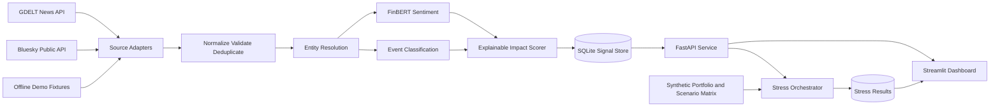

# RiskSignal Engine Architecture and Implementation Decisions

## Purpose

RiskSignal Engine will ingest unstructured financial news and social-media text,
produce structured and explainable financial-risk signals, and demonstrate those
signals through an event-driven portfolio stress-testing application.

The implementation must process at least two source types and produce a sentiment
score, event classification, and impact score. The selected downstream application
is strategic portfolio stress testing. Tactical index rebalancing remains a possible
future extension but is not part of the initial implementation.

## Success Criteria

- Process news and social text through live adapters and deterministic offline fixtures.
- Produce a signed sentiment score between -1 and 1.
- Classify each accepted record into a documented financial-event taxonomy.
- Produce an explainable integer impact score from 1 through 10.
- Preserve source, query, retrieval, transformation, and model provenance.
- Expose signals and stress results through a versioned HTTP API.
- Trigger a stress test when a relevant signal has an impact score greater than 7.
- Visualize signal history and portfolio value before and after stress.
- Run tests without requiring network access.
- Use only public or clearly identified synthetic data.

## System Context



## Component Responsibilities

### Source adapters

The GDELT adapter retrieves recent news metadata and headlines for configured company
aliases and risk terms. The Bluesky adapter retrieves public posts using the same
watchlist. Each adapter implements a common interface and returns source-specific
records without applying financial interpretation.

Offline fixture adapters use committed JSON snapshots with the same normalized shape.
They are the default for automated tests and the reproducible demonstration. A failure
in one live source must be recorded without preventing other sources from completing.

### Normalization and provenance

Normalization converts source records into a common `RawDocument` contract. It
normalizes Unicode, whitespace, language, URLs, and UTC timestamps. Records are
deduplicated using their source identifier, canonical URL when available, and a hash
of normalized text.

Every record retains its source name, source type, original identifier or URL,
publication time, retrieval time, query, language, synthetic flag, and content hash.

### NLP risk engine

Entity resolution uses a versioned issuer watchlist and aliases matching the synthetic
portfolio. FinBERT supplies positive, negative, and neutral probabilities; the signed
sentiment score is `P(positive) - P(negative)`.

Event classification uses sentence embeddings compared with curated category
descriptions, with explicit keyword evidence used as a bounded tie-breaker. The event
taxonomy is:

- Geopolitical
- Macroeconomic
- Credit Event
- Merger or Acquisition
- Product Launch
- Regulatory
- Operational
- Other

The impact score is deterministic and explainable:

```text
10 x (
  0.30 x event severity prior
  + 0.20 x absolute sentiment
  + 0.20 x event classification confidence
  + 0.15 x entity relevance
  + 0.10 x cross-source corroboration
  + 0.05 x recency
)
```

The result is rounded and clamped to the inclusive range 1 through 10. The individual
factors and model revisions are stored with each signal so the score can be explained
and reproduced.

### Persistence and API

SQLite is the initial persistence layer because it keeps local setup deterministic and
requires no external service. Repository interfaces will isolate persistence details so
a server database can be introduced later without changing the NLP or stress services.

The versioned API will provide:

- `GET /health`
- `GET /api/v1/sources/status`
- `POST /api/v1/ingestion/run`
- `POST /api/v1/analyze`
- `GET /api/v1/signals`
- `GET /api/v1/signals/{signal_id}`
- `POST /api/v1/stress-tests`
- `GET /api/v1/stress-tests/{result_id}`
- `GET /api/v1/portfolio/summary`

### Stress-testing application

The portfolio is fully synthetic and uses fictional issuers. It contains loans, bonds,
equities, and derivatives with only the fields needed for the simplified valuation
models. Scenario shocks are configuration data rather than code.

- Bonds use duration-based losses from rate and credit-spread shocks.
- Loans use stressed probability of default and loss-given-default assumptions.
- Equities use direct percentage price shocks.
- Derivatives use delta and DV01 approximations.

Stress results retain the triggering signal, scenario version, affected scope, applied
shocks, before and after values, expected-loss change, and instrument-level results.
Portfolio totals must reconcile to the sum of instrument results within a documented
numeric tolerance.

### Dashboard

The Streamlit dashboard consumes the API rather than duplicating business logic. It
shows source health, a filterable risk-signal stream, provenance, impact-score factors,
scenario assumptions, and portfolio loss breakdowns by asset class, sector, issuer,
and instrument.

## Core Data Contracts

`RawDocument` contains the normalized text and complete source provenance.

`RiskSignal` contains the document reference, resolved entities, sentiment label and
score, event type and confidence, impact score and factors, source provenance, model
versions, and creation timestamp.

`StressResult` contains the trigger signal, scenario, portfolio version, aggregate
before and after measures, total loss, loss percentage, expected-loss change, and
instrument-level details.

These contracts will be implemented as strict Pydantic models. Unknown event types,
out-of-range scores, naive timestamps, and missing provenance fields will be rejected.

## Dataset and Model Governance

All runnable demo data will live under `data/`. A machine-readable source manifest and
a human-readable data guide will record source URLs, retrieval dates, access method,
license or terms link, redistribution status, transformations, assumptions, checksums,
and whether each artifact is public, synthetic, or derived.

The repository will not contain API keys, model weights, runtime databases, bulk API
dumps, scraped article bodies, real client data, or confidential S&P Global or Crisil
information. Model identifiers and immutable revisions will be documented so first-run
downloads are reproducible.

## Reliability and Failure Handling

- Apply request timeouts, bounded retries, and backoff to live sources.
- Report source failures individually and continue with healthy adapters.
- Validate inputs before model inference and enforce a maximum text length.
- Use batch inference and initialize each model once per process.
- Default automated tests to fixtures so external outages do not cause test failures.
- Surface live-versus-offline mode and stale data clearly in the API and dashboard.
- Never silently replace a failed live result with a fixture in the same run.

## Verification Strategy

- Unit tests for adapters, normalization, entity resolution, scoring, and valuation.
- Mocked integration tests for all external HTTP behavior.
- Golden fixtures for sentiment, event categories, provenance, and score boundaries.
- API contract tests covering validation, filtering, and failure responses.
- Numeric reconciliation tests for portfolio totals and stress losses.
- An offline end-to-end test covering both source types through stress results.
- A documented benchmark that distinguishes synthetic evaluation data from real data.

## Scope Boundaries

The initial implementation excludes live trading, investment recommendations,
portfolio optimization, full revaluation models, fine-tuning foundation models,
multi-user authentication, production-scale streaming infrastructure, Module A,
cloud deployment, presentation creation, and video recording.

The recorded walkthrough may run for up to ten minutes under the submission guidance,
while the deterministic live demonstration path will be designed to fit within five
minutes as required by the problem statement.

## Target Repository Layout

```text
README.md
LICENSE
progress.md
pyproject.toml
requirements.txt
.env.example
.gitignore
data/
docs/
src/risk_engine/
tests/
```

Large generated artifacts, model caches, runtime data, and local environment files
will remain outside version control.
